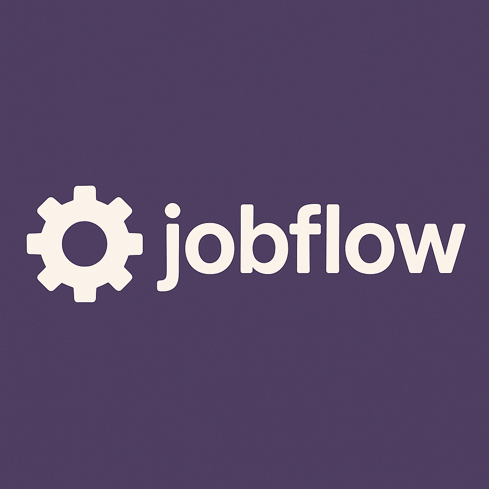

# jobflow

<b>A learning project to build a distributed job orchestration system in Flask.</b>

## What `jobflow` aims to do
**A small, composable platform that accepts work, schedules it, runs it reliably, and tells the end user what happened.**

Sort of like my own tiny GitHub Actions / Celery Platform that will help me understand end-to-end, scale, and overtime make smarter

---

## What we will accomplish (the system + me)
### Skills + Portfolio
- **System design depth**: queues, workers, scheduling, backpressure, idempotency, retries, eventual consistency.
- **Production engineering**: health/readiness, metrics, tracing, logs, ci/cd, rollouts, dashboard, SLO thinking.
- **Platform chops**: Docker -> Compose -> Kubernetes(+ autoscaling with queue depth)
- **Algorithm/AI layer**: heuristics -> simple models for runtime prediction & smart scheduling.
- **A flagship repo**: clean API, docs, tests, charts -- demoable & extensible.

### Architecture Capabilities
- **Clear contracts**: REST API for jobs/status/logs/metrics; OpenAPI for clients.
- **Isolation & reliability**: jobs run in workers, not in the API; retries, timeouts, dead-letter handling.
- **Scalability**: horizontal workers; scale by queue depth; stateless API.
- **Observability**: Prometheus metrics, structured logs, traces; Grafana dashboards.
- **Extensibility**: plug different backends (in-memory -> Redis -> Postgres), different runners (shell, python, ML).
- **Policy & scheduling**: First In First Out (FIFO) first, then shortest-job-first, priorities, and later: ML-aided placement.
- **Portability**: local dev on Compose, prod on k8s with Helm, infra w/ Terraform.
---
## Target Architecture (progress)
1. **Monolith-in-memory** → here
   - Flask API + in-mem store; enqueue/read status 
2. **In-process runner**
   - Background thread moves `queued -> running -> done`; basic lifecycle & logs
3. **Split API vs Workers**
    - Separate processes; contract via queue interface; first with shared local store
4. **Real queue + persistence**
    - Redis or Celery; Postgres for jobs/events/logs; idempotent handlers; retries & DLQ
5. **Cloud native**
    - k8s deploy; readiness/liveness; KEDA autoscaling; OTEL tracing; dashboards + alerts
6. **Intelligence**
    - predict runtime class; priority suggestion; anomaly detection on durations; A/B scheduling policies
---
## Core design Principles Practiced
- **Ports & Adapters**: abstract `QueuePort`, `ResultStore`, `LoggerPort` -> swap implementations without API churn
- **Idempotency & exactly-one semantics**: job tokens, dedupe keys, safe retries
- **Backpressure & flow control**: rate limits, concurrent worker caps, visibility timeouts 
- **Failure as a first-class citizen**: retires with jitter, circuit breakers for external calls, DLQ surfacing
- **Operational Clarity**: every state change emits an event; metrics capture rates/latencies;logs are correlated.
---
## North-Star (what "done" looks like):
- submit a job -> get an `ID` immediately
- Query status/logs/events; subscribe to updates (later: websockets/webhooks)
- Observe queue depth; throughput; p50/p95 end-to-end latency; failure rate, retry rate
- Scale workers to meet SLO; see the impact live on dashboards
- Switch policies (FIFO <-> SJF <-> priority) and show measurable changes in p95.
- Optional: enable "smart scheduling" and prove reduced wait times vs baseline
---
## Not my goals
- Am not looking to build a full CI system
- Don't plan to have this "production" ready in the sense that others will use it
---
## Helps my 12-month plan
I have 3 pillars I am looking to build.
- Pillar A (SE & system design): concurrency, distributed patters, APIs, testing.
- Pillar B (Platform): IaC, k8s, observability, autoscaling, SRE practices.
- Pillar C (AI/Optimization): data-driven scheduling and anomaly detection on a real system built.